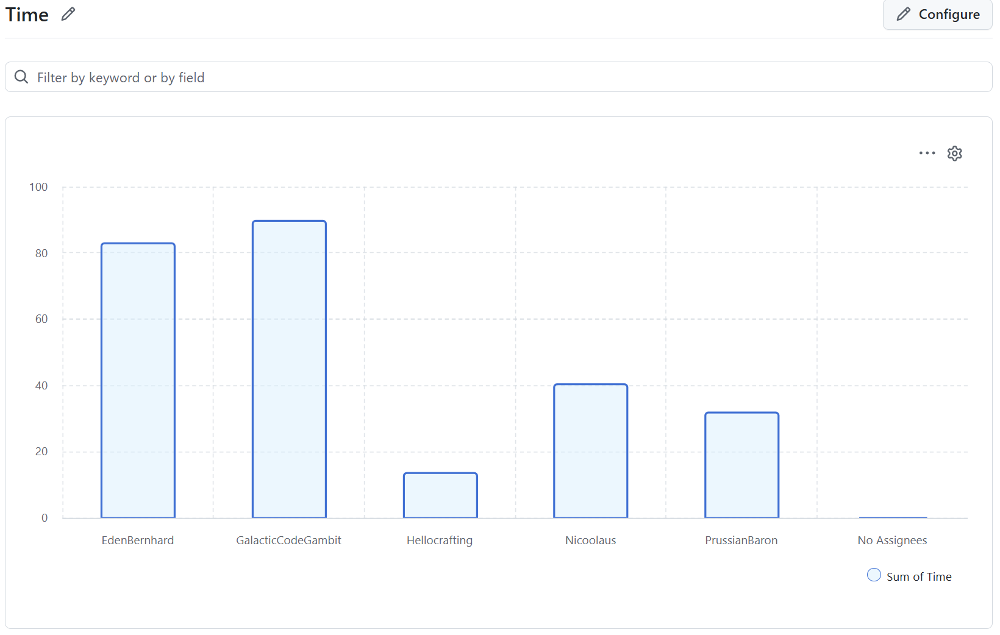
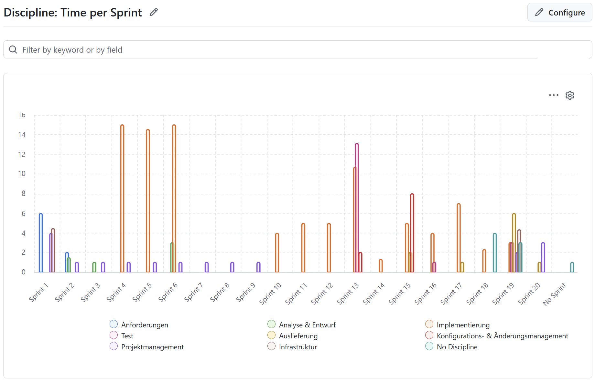
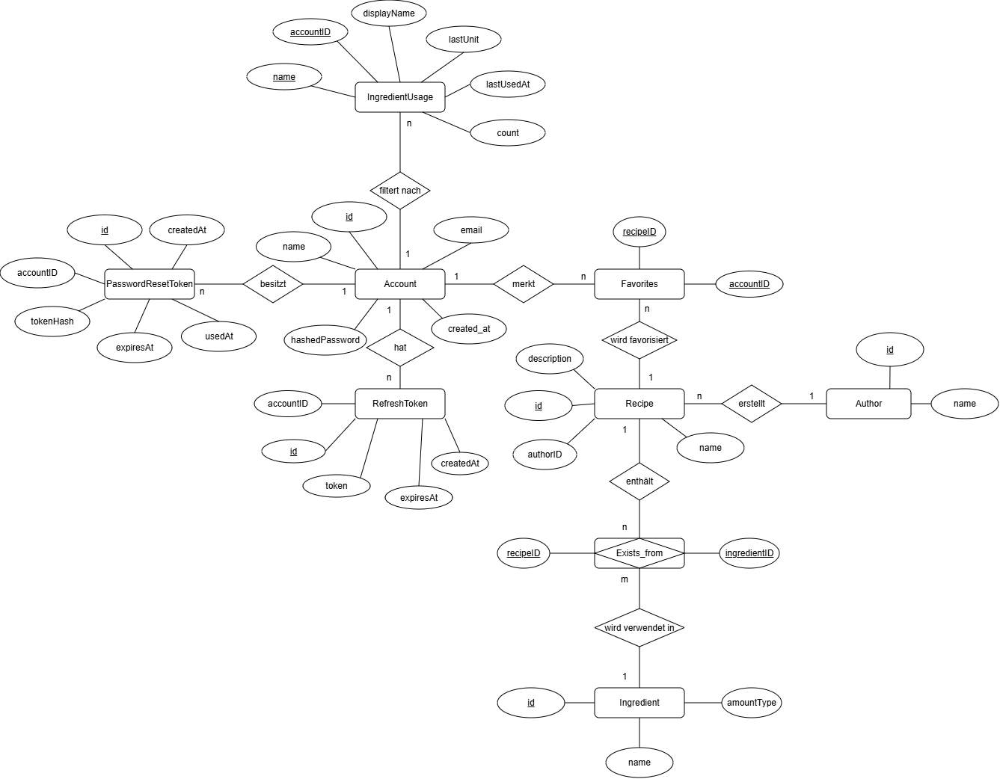

# LazyCook – Projekt-Handout

> **Webanwendung zur intelligenten Rezeptsuche anhand vorhandener Zutaten**  
> DHBW Karlsruhe · Software Engineering · 4. Semester

---

## Team

| Name | GitHub-Handle      | Hauptbeiträge |
|------|--------------------|---------------|
| Eden Bernhard | EdenBernhard       | Frontend (Next.js/React), Authentication-Flow, Metriken & SonarCloud |
| Samuel Göbel | PrussianBaron      | Product-Owner, SUCUK-Algorithmus, Datenbankdesign |
| Frederik Behne | GalacticCodeGambit | CI/CD-Pipeline, Linter, Docker |
| Niclas Matzke | Nicoolaus          | Backend-Tests, Frontend Rezeptanzeige |
| Alexander Groer | Hellocrafting      | Code-Reviews, Datenbankbefüllung (Normalisierung, Übersetzung) |

**Betreuer:** Harald Ichters (DHBW Karlsruhe)

---

## Statistiken

### Stunden pro Person



| Person | Stunden (ca.) |
|--------|--------------|
| Samuel Göbel (GalacticCodeGambit) | ~37 h |
| Eden Bernhard (EdenBernhard) | ~25 h |
| Niclas Matzke (Nicoolaus) | ~18 h |
| Alexander Groer (PrussianBaron) | ~10 h |
| Frederik Behne (Hellocrafting) | ~6 h |

### Stunden pro Disziplin



Die Implementierung dominiert klar in Sprint 4 und 6 (~15 h/Sprint). Sprint 1 war anforderungslastig, danach verschob sich der Fokus auf Analyse & Entwurf und schließlich auf reine Implementierung.

### Stunden pro Phase (Milestone)


| Phase | Schwerpunkt-Sprints |
|-------|---------------------|
| 1. Anforderungsdefinition | Sprint 1–2 |
| 2. Planung & Entwurf | Sprint 1–3, Sprint 6 |
| 3. Implementierung | Sprint 4–6 (Kern) |
| 5. Deployment | Sprint 7–9 |

---

## Projektziel & Vision

**LazyCook** löst ein alltägliches Problem: *Was koche ich heute mit dem, was ich zu Hause habe?*

Nutzer geben ihre vorhandenen Zutaten (Name, Menge, Einheit) und die Personenanzahl ein – LazyCook filtert daraufhin passende Rezepte und zeigt sie übersichtlich als **3×4-Matrix** an. So wird Lebensmittelverschwendung reduziert und lästige Einkäufe werden gespart.

**Kernziele:**
- Schnell: Rezepte in **< 5 Sekunden** nach Klick auf „Filtern"
- Sicher: Passwörter gehasht mit **bcrypt + automatischem Salt**
- Benutzerfreundlich: Registrierung → RecipeFinder in **wenigen Klicks** (ADR02)
- Cross-Browser-kompatibel: Chrome, Firefox, Safari, Edge

---

## Demo-Highlights

Die Demo zeigt den vollständigen Nutzerflow:

1. **Registrierung & Login** – E-Mail/Passwort-Formular mit clientseitiger und serverseitiger Validierung, direkte Weiterleitung zum RecipeFinder ohne erneute Anmeldung (ADR02)
2. **Zutateneingabe** – Zutaten mit Name, Menge und Einheit eintragen; Vorschläge häufiger Zutaten werden automatisch angeboten
3. **Rezeptfilterung (SUCUK)** – Echtzeitfilterung der Datenbank; Rezepte werden nach Übereinstimmungsgrad sortiert und als 3×4-Matrix angezeigt
4. **Mehr laden** – Über „Mehr anzeigen" können bis zu 96 Rezepte nachgeladen werden (ADR03)
5. **Rezeptsuche nach Name** – Freitextsuche im Suchfeld findet Rezepte mit ähnlichem Titel
6. **Profilverwaltung** – E-Mail ändern, Passwort ändern, Konto löschen

---

## Architektur

LazyCook folgt einem **schichtbasierten Architekturstil** (ADR04) mit drei klar getrennten Schichten:

```
┌─────────────────────────────────────────────┐
│             Browser (Nutzer)                │
└──────────────────┬──────────────────────────┘
                   │ HTTP (Port 8000)
┌──────────────────▼──────────────────────────┐
│   Frontend – Next.js 16 / React 19          │
│   TypeScript · Tailwind CSS · shadcn/ui     │
│   Seiten: Homepage · Login · RecipeFinder   │
└──────────────────┬──────────────────────────┘
                   │ REST API / JSON (Port 3000)
┌──────────────────▼──────────────────────────┐
│   Backend – Python / FastAPI                │
│   Gunicorn + Uvicorn (4 Worker)             │
│                                             │
│  routes/   services/   core/    dao/        │
│  Auth      AuthSvc     Auth     AccountDAO  │
│  Recipe    UserSvc     DB       RecipeDAO   │
│  User      SUCUK       Models   IngrDAO     │
└──────────────────┬──────────────────────────┘
                   │ SQLite3
┌──────────────────▼──────────────────────────┐
│   Datenbank – SQLite (LazyCookDB.sqlite3)   │
│   Account · RefreshToken · Recipe ·         │
│   Ingredient · Exists_from · Author ·       │
│   PasswordResetToken · Favorites            │
└─────────────────────────────────────────────┘
```

**Deployment:** Zwei Docker-Container (Frontend + Backend) via **Docker Compose**, SQLite wird in einem persistierten Docker-Volume gespeichert.

### Backend-Paketstruktur

Das Backend ist nach dem **Single Responsibility Principle** (ADR05) in klar getrennte Pakete aufgeteilt:

| Paket | Verantwortung |
|-------|---------------|
| `core/` | Infrastruktur: Datenbankverbindung, JWT/Auth-Logik, Pydantic-Modelle |
| `dao/` | Datenzugriffsschicht: je ein DAO pro Domänenobjekt (Account, Recipe, Ingredient) |
| `domain/` | Domänenmodelle: Recipe, Ingredient, Person |
| `routes/` | API-Endpunkte: AuthRoutes, RecipeRoutes, UserRoutes |
| `services/` | Geschäftslogik: SUCUK-Algorithmus, AuthService, UserService, EmailService |

---

## Datenbank-Design



| Tabelle | Schlüsselfelder | Beschreibung |
|---------|-----------------|--------------|
| `Account` | id, email, hashedPassword, createdAt | Benutzerkonten – Passwörter niemals im Klartext |
| `RefreshToken` | id, AccountID → Account, token, expiresAt | JWT Refresh Tokens mit Ablaufdatum |
| `PasswordResetToken` | id, kontoID → Account, tokenHash, expiresAt, usedAt | Einmalige Reset-Tokens für „Passwort vergessen" |
| `Recipe` | id, name, description, vid → Author | Rezept-Entitäten |
| `Ingredient` | id, name, mengenArt | Zutaten-Stammdaten |
| `Exists_from` | zid → Ingredient, rid → Recipe, menge | N:M-Beziehung Zutat ↔ Rezept |
| `Author` | id, name | Rezeptautoren |
| `Favorites` | AccountID → Account, rid → Recipe | Favoritenliste je Account |

---

## SUCUK-Algorithmus

**SUCUK** = *Search for Uncomplicated Cooking and User-friendly Kitchen recipes*

Der Algorithmus erhält die eingetragenen Zutaten und Personenanzahl, gleicht sie gegen die `Exists_from`-Tabelle ab und bewertet jedes Rezept nach Übereinstimmungsgrad:

```python
def findRecipes(ingredients: list, index: int) -> list[Recipe]:
    recipes = _initRecipes()

    for ingredient in ingredients:
        _scoreRecipes(recipes, ingredient)

    recipes.sort(key=lambda r: r.getRating(), reverse=True)
    return recipes[12 * index : 12 * (index + 1)]   # Paginierung: 12 pro Seite


def _scoreRecipes(recipes: list[Recipe], ingredient) -> None:
    for recipe in recipes:
        for recipeIngredient in recipe.getIngredients():
            if recipeIngredient.getName() == ingredient.getName():
                recipe.incrementMatching()
                recipe.setRating(recipe.getMatching() / len(recipe.getIngredients()))
```

Das Rating ergibt sich als `Anzahl übereinstimmender Zutaten / Gesamtzutaten des Rezepts`. Rezepte mit höchster Übereinstimmung erscheinen zuerst. Die Paginierung liefert jeweils 12 Ergebnisse; per „Mehr anzeigen" werden bis zu 96 Rezepte geladen.

---

## Verwendete Technologien & Tools

### Frontend
| Technologie | Zweck |
|-------------|-------|
| **Next.js 16** | React-Framework, SSR/CSR |
| **React 19** | UI-Komponentensystem |
| **TypeScript** | Typsichere Entwicklung |
| **Tailwind CSS** | Utility-First-Styling |
| **shadcn/ui + Radix UI** | Barrierefreie UI-Komponenten |
| **Lucide Icons** | Icon-Bibliothek |

### Backend
| Technologie | Zweck |
|-------------|-------|
| **Python 3.11** | Hauptsprache |
| **FastAPI** | REST-API-Framework |
| **Gunicorn + Uvicorn** | ASGI-Server (4 Worker) |
| **Pydantic** | Request/Response-Validierung |
| **bcrypt** | Passwort-Hashing mit automatischem Salt |
| **python-jose** | JWT-Erzeugung und -Validierung |

### Datenbank & Infrastruktur
| Technologie | Zweck |
|-------------|-------|
| **SQLite 3** | Eingebettete relationale Datenbank |
| **Docker / Docker Compose** | Containerisierung & Deployment |
| **Node.js 24 (alpine)** | Frontend-Container-Basis |
| **Python 3.11 (slim)** | Backend-Container-Basis |

### Qualität & DevOps
| Technologie | Zweck |
|-------------|-------|
| **GitHub Actions** | CI/CD-Pipelines |
| **Pytest + pytest-cov** | Backend Unit-Tests & Coverage |
| **Super-Linter** | Python (Black, Flake8) + TS/CSS-Linting |
| **SonarCloud** | Statische Code-Analyse, Metriken, Quality Gate |
| **CodeQL** | Automatische Sicherheitsanalyse |
| **GitHub Projects** | Agiles Projektmanagement (Kanban, 9 Sprints) |

---

## Tests & CI/CD

### CI/CD-Pipeline (GitHub Actions)

```
Push / PR → main
      │
      ├─▶ [ci.yml]          Docker Compose Build
      │                     → Services starten
      │                     → Smoke-Test Frontend (Port 8000)
      │                     → pytest Backend-Tests (im Container)
      │
      ├─▶ [lint.yml]        Super-Linter
      │                     → Python: Black + Flake8
      │                     → TypeScript/JS: ESLint
      │                     → CSS, Dockerfile, YAML, GitHub Actions
      │
      ├─▶ [sonarqube.yml]   pytest mit Coverage-Report (XML)
      │                     → SonarCloud Scan
      │                     → Quality Gate Check
      │
      └─▶ [codeql.yml]      CodeQL-Analyse
                            → Python, TypeScript, Actions
```

### Test-Suite (Backend)

| Bereich | Testfälle | Status |
|---------|-----------|--------|
| E-Mail-Validierung | Gültige & ungültige Formate | ✅ bestanden |
| Passwortvalidierung | Länge, Groß-/Kleinbuchstaben, Zahlen, Sonderzeichen | ✅ bestanden |
| Passwort-Hashing | Hash-Erzeugung & Verifikation | ✅ bestanden |
| JWT-/Token-Logik | Access, Refresh, Reset Tokens, Ablauf | ✅ bestanden |
| Datenbankzugriffe | Account CRUD, Token-Verwaltung | ✅ bestanden |
| Rezept- & Zutatenverwaltung | Anlegen, Verknüpfen, Auslesen | ✅ bestanden |
| SUCUK-Algorithmus | Trefferbewertung, Sortierung, Paginierung | ✅ bestanden |
| CI-Smoketest | Erreichbarkeit Frontend nach Start | ✅ bestanden |

**Gesamt: 74 automatisierte Testfälle · 6 Testmodule · 0 bekannte Fehler**

### SonarCloud-Metriken (Stand: Juni 2026)

| Kategorie | Wert |
|-----------|------|
| Automatisierte Testfälle | 74 |
| Code-Coverage gesamt | **48,3 %** |
| Line Coverage | **50,8 %** |
| Branch Coverage | **34,6 %** |
| Coverable Lines | 711 |
| Gedeckte Zeilen | 361 |
| Coverable Branches | 130 |
| Gedeckte Branches | 45 |

---

## Metriken & Refactoring

SonarCloud misst drei Kernmetriken kontinuierlich: **Coverage**, **Zyklomatische Komplexität** und **Code-Duplikate**. Im Folgenden werden alle drei erklärt, mit konkreten Codebeispielen belegt und bewertet – inklusive Fällen, in denen ein schlechter Wert bewusst akzeptiert wurde.

### Übersicht: Aktueller Stand (Juni 2026)

| Metrik | Wert | Bewertung |
|--------|------|-----------|
| **Line Coverage** | 50,8 % (361 / 711 Zeilen) | Kern-Logik gut abgedeckt; E-Mail-/Route-Layer bewusst ausgenommen |
| **Branch Coverage** | 34,6 % (45 / 130 Branches) | Niedrig durch untestbare `except`-Pfade (SMTP, Logging) |
| **Zyklomatische Komplexität** | Ø niedrig pro Datei | Durch Dateiaufteilung deutlich gesunken; Einzelfälle ≤ 6 akzeptiert |
| **Code-Duplikate** | Minimal (1 bekannter 4-Zeiler) | Verbindungslogik zentralisiert; verbleibende Duplikate bewusst belassen |
| **Testfälle gesamt** | 74 | 6 Module, 0 bekannte Fehler |
| **Coverable Lines** | 711 | davon 350 ungedeckt (hauptsächlich EmailService + Routes) |

---

### Metrik 1: Coverage (Testabdeckung)

**Was bedeutet Coverage?**
Coverage misst, welcher Anteil des Codes tatsächlich durch Tests ausgeführt wird. SonarCloud unterscheidet:
- **Line Coverage:** Anteil der Zeilen, die mindestens einmal von einem Test durchlaufen wurden
- **Branch Coverage:** Anteil der Verzweigungen (if/else, try/except), bei denen beide Pfade (true und false) getestet wurden

**Unsere Werte:**

| Metrik | Wert |
|--------|------|
| Line Coverage | **50,8 %** (361 von 711 Zeilen gedeckt) |
| Branch Coverage | **34,6 %** (45 von 130 Branches gedeckt) |

**Gut abgedeckte Bereiche**

`services/AuthService.py` ist vollständig mit Mock-Tests abgedeckt. Beispiel aus `test_auth_tokens.py`:

```python
# Alle relevanten Pfade werden getestet:
class TestPasswordResetToken:
    def testGueltigerToken(self): ...       # Pfad: Token gültig → Entry zurückgeben
    def testUngueltigerToken(self): ...     # Pfad: Token nicht in DB → None
    def testBereitsVerwendeterToken(self): ...  # Pfad: usedAt gesetzt → None
    def testAbgelaufenerResetToken(self): ...   # Pfad: expiresAt < jetzt → None
```

Jeder mögliche Rückgabepfad in `validatePasswordResetToken` ist durch einen eigenen Testfall abgesichert.

**Nicht abgedeckte Bereiche – und warum das akzeptabel ist**

`services/EmailService.py` ist nicht direkt durch Tests abgedeckt. Der Grund: Die Funktionen bauen eine echte SMTP-Verbindung zu Gmail auf – das ist in einer CI-Umgebung nicht möglich.

```python
# EmailService.py – dieser Code läuft in der CI nie durch
def _sendMail(to: str, subject: str, html: str) -> None:
    with smtplib.SMTP_SSL("smtp.gmail.com", 465) as server:
        server.login(gmailUser, gmailPassword)   # kein Gmail-Zugang in CI
        server.sendmail(gmailUser, to, msg.as_string())
```

Stattdessen werden in Tests, die E-Mail-Versand auslösen, die Email-Funktionen gemockt:

```python
# In Test-Dateien: echter E-Mail-Aufruf wird durch Mock ersetzt
with patch("services.EmailService.sendPasswordResetEmail"):
    ...
```

Die `except`-Zweige in den Routen, die E-Mail-Fehler abfangen, bleiben dadurch ungetestet – das erklärt die niedrige Branch Coverage von 34,6 %. Da diese Branches nur Logging auslösen (kein kritischer Pfad), ist das vertretbar.

```python
# routes/AuthRoutes.py – der except-Branch wird in Tests nie ausgelöst
try:
    sendPasswordResetEmail(body.email, konto["name"], resetLink)
except Exception as e:
    logger.warning("Reset-Mail konnte nicht gesendet werden: %s", e)  # ← nicht gedeckt
```

---

### Metrik 2: Zyklomatische Komplexität

**Was bedeutet Zyklomatische Komplexität?**
Die zyklomatische Komplexität (CC) einer Funktion zählt die Anzahl unabhängiger Pfade durch ihren Kontrollfluss. Jedes `if`, `elif`, `for`, `while`, `and`, `or` erhöht den Wert um 1. Ausgangswert ist 1. Faustregel: CC ≤ 5 = gut, CC 6–10 = akzeptabel, CC > 10 = zu hoch.

**Wo Refactoring die Komplexität gesenkt hat**

Die ursprüngliche `LazyCookAdministration.py` enthielt alle Route-Handler – jede Validierung, jeder DB-Zugriff, jede Fehlerbehandlung in einer Datei. Die Datei-Komplexität war dadurch sehr hoch (viele Endpunkte × ihre jeweiligen Branches).

```
# Vorher – eine Datei trägt die Komplexität aller Endpunkte
LazyCookAdministration.py
  @app.post("/auth/register")  # CC += 3 (name-check, emailError, pwError)
  @app.post("/auth/login")     # CC += 2 (account-check, password-check)
  @app.post("/auth/logout")    # CC += 1
  @app.get("/recipes/filter")  # CC += 2
  ... weitere Endpunkte
  # Datei-CC: ~20+

# Nachher – Verantwortung verteilt, jede Datei bleibt überschaubar
# routes/AuthRoutes.py enthält nur Auth-Endpunkte → Datei-CC: ~12
# routes/RecipeRoutes.py → CC: ~4
# routes/UserRoutes.py   → CC: ~6
```

**Wo hohe Komplexität akzeptabel ist**

`validatePassword` in `core/Auth.py` hat eine zyklomatische Komplexität von **6** (5 `if`-Anweisungen + Basiswert 1):

```python
def validatePassword(pw: str) -> str | None:
    if len(pw) < 8:                          # +1
        return "..."
    if not re.search(r"[A-Z]", pw):         # +1
        return "..."
    if not re.search(r"[a-z]", pw):         # +1
        return "..."
    if not re.search(r"[0-9]", pw):         # +1
        return "..."
    if not re.search(r"[^A-Za-z0-9]", pw):  # +1
        return "..."
    return None
    # Zyklomatische Komplexität: 6
```

CC = 6 liegt über dem Idealwert, aber **kein Refactoring nötig**: Jede Bedingung ist eine eigenständige, inhaltlich sinnvolle Regel. Sie in eine Schleife oder separate Funktionen aufzuteilen würde die Lesbarkeit verschlechtern, ohne die Logik zu vereinfachen.

**Wo niedrige Komplexität von Anfang an gut war**

Der SUCUK-Algorithmus hat trotz verschachtelter Schleifen eine niedrige CC, weil er kaum Verzweigungen hat:

```python
def _scoreRecipes(recipes: list[Recipe], ingredient) -> None:
    for recipe in recipes:                        # +1 (Schleife)
        for recipeIngredient in recipe.getIngredients():  # +1 (Schleife)
            if recipeIngredient.getName() == ingredient.getName():  # +1
                recipe.incrementMatching()
                recipe.setRating(recipe.getMatching() / len(recipe.getIngredients()))
    # Zyklomatische Komplexität: 4 – kein Handlungsbedarf
```

---

### Metrik 3: Code-Duplikate

**Was sind Code-Duplikate?**
SonarCloud flaggt Code-Blöcke, die an mehreren Stellen nahezu identisch vorkommen. Duplikate erhöhen die Wartungskosten: Eine Bugfix-Änderung muss an allen duplizierten Stellen gleichzeitig gemacht werden.

**Wo Refactoring Duplikate beseitigt hat**

Vor der Paketaufteilung war die Datenbankverbindungs-Logik in der monolithischen `Database.py` für jede Funktion einzeln ausgeschrieben. Das Muster `open – cursor – execute – close` wiederholte sich ~20-mal.

```python
# Vorher – Verbindungsmanagement dupliziert in jeder Funktion
def getAccountByEmail(email):
    con = sqlite3.connect("LazyCookDB.sqlite3")   # ← wiederholt sich überall
    con.row_factory = sqlite3.Row
    cur = con.cursor()
    cur.execute("SELECT * FROM Account WHERE email = ?", (email,))
    result = cur.fetchone()
    con.close()                                   # ← wiederholt sich überall
    return result

def getRecipes():
    con = sqlite3.connect("LazyCookDB.sqlite3")   # ← gleiche 3 Zeilen
    con.row_factory = sqlite3.Row
    cur = con.cursor()
    ...
    con.close()
```

Nach der Refactoring kommt die Verbindungslogik genau einmal vor – in `core/Database.py`:

```python
# core/Database.py – Verbindungslogik zentral, kein Duplikat mehr
@contextmanager
def getDB():
    con = getConnection()
    try:
        yield con
        con.commit()
    except Exception:
        con.rollback()
        raise
    finally:
        con.close()

# dao/AccountDAO.py – nutzt getDB(), keine Verbindungslogik mehr
def getAccountByEmail(email: str) -> dict | None:
    con = getConnection()
    try:
        cur = con.cursor()
        cur.execute("SELECT id, email, name, hashedPassword FROM Account WHERE email = ?", (email,))
        row = cur.fetchone()
        return dict(row) if row else None
    finally:
        con.close()
```

**Wo Duplikate bewusst akzeptiert wurden**

In `services/AuthService.py` ist das Muster zur Ablaufprüfung eines Tokens in zwei Funktionen nahezu identisch:

```python
# validateRefreshToken – Ablaufcheck
def validateRefreshToken(token: str) -> dict | None:
    entry = AccountDAO.getRefreshToken(token)
    if entry is None:
        return None
    expiresAt = datetime.fromisoformat(entry["expiresAt"])   # ┐
    if expiresAt.tzinfo is None:                             # │ diese 4 Zeilen
        expiresAt = expiresAt.replace(tzinfo=timezone.utc)  # │ sind dupliziert
    if expiresAt < datetime.now(timezone.utc):               # ┘
        return None
    return entry

# validatePasswordResetToken – exakt das gleiche Muster
def validatePasswordResetToken(token: str) -> dict | None:
    entry = AccountDAO.getPasswordResetToken(hashResetToken(token))
    if entry is None or entry["usedAt"] is not None:
        return None
    expiresAt = datetime.fromisoformat(entry["expiresAt"])   # ┐
    if expiresAt.tzinfo is None:                             # │ identisch
        expiresAt = expiresAt.replace(tzinfo=timezone.utc)  # │
    if expiresAt < datetime.now(timezone.utc):               # ┘
        return None
    return entry
```

SonarCloud flaggt diesen 4-Zeilen-Block als Duplikat. **Kein Refactoring nötig**, weil:
1. Es handelt sich um nur 2 Vorkommen und 4 Zeilen – der Overhead einer Hilfsfunktion wäre größer als der Nutzen
2. Beide Funktionen operieren auf unterschiedlichen Token-Typen mit leicht abweichender Vorlogik; eine gemeinsame Funktion würde Abstraktionszwang erzeugen, der die Lesbarkeit eher senkt
3. Das Muster ist selbsterklärend und unwahrscheinlich, sich zu ändern

---

## Highlights

| # | Highlight | Details |
|---|-----------|---------|
| 1 | **Sicherheit** | bcrypt-Passwort-Hashing mit automatischem Salt; JWT mit Access- und Refresh-Tokens; sensible Daten in `.env` |
| 2 | **SUCUK-Algorithmus** | Eigenentwickelter Rezept-Ranking-Algorithmus – sortiert nach prozentualem Zutatenübereinstimmungsgrad |
| 3 | **Vollständige CI/CD-Pipeline** | 4 parallele GitHub Actions Workflows: CI, Linting, SonarCloud, CodeQL |
| 4 | **Backend-Paketarchitektur** | Klare Schichten: `core/` · `dao/` · `domain/` · `routes/` · `services/` – jede Datei hat eine Verantwortung |
| 5 | **5 dokumentierte ADRs** | Jede Schlüsselentscheidung mit Kontext, Alternativen und Konsequenzen dokumentiert |
| 6 | **74 automatisierte Tests** | Risikobasierte Teststrategie: Unit-Tests, DB-Integrationstests, Mock-Tests, CI-Smoketest |
| 7 | **SonarCloud Quality Gate** | Kontinuierliche Qualitätsmessung: 48,3 % Coverage, 0 bekannte Bugs im getesteten Umfang |
| 8 | **Docker-Deployment** | Reproduzierbares Setup mit `docker compose up` – Frontend und Backend vollständig containerisiert |

---

## Ressourcen

- **GitHub:** [github.com/GalacticCodeGambit/LazyCook](https://github.com/GalacticCodeGambit/LazyCook)
- **SonarCloud:** [sonarcloud.io/project/overview?id=GalacticCodeGambit_LazyCook](https://sonarcloud.io/project/overview?id=GalacticCodeGambit_LazyCook)
- **ADRs:** `docs/adr/`
- **Mockups:** `docs/mockup/`
- **Architekturdokument:** `docs/Softwarearchitekturdokument.md`

---

*Handout erstellt für die Abschlusspräsentation · DHBW Karlsruhe · Juni 2026*
