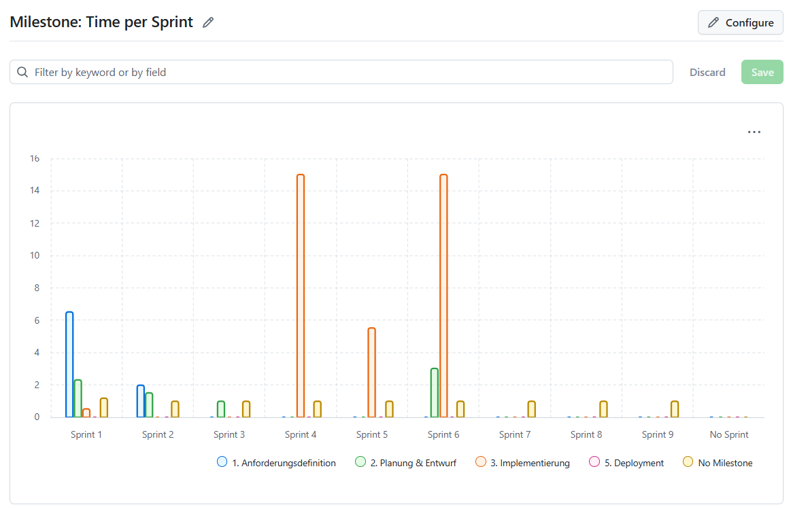
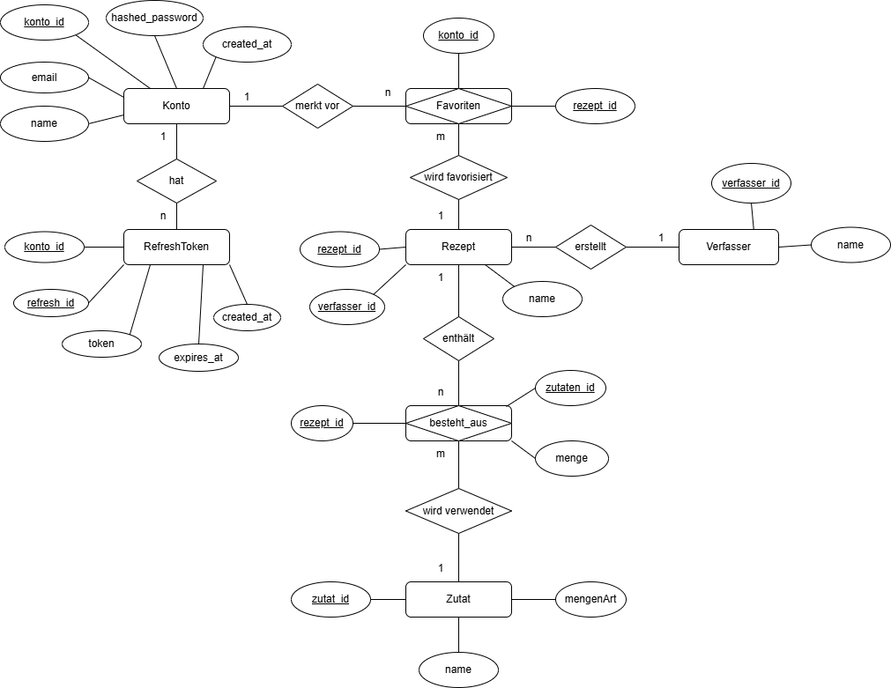

# 🍳 LazyCook – Projekt-Handout

> **Webanwendung zur intelligenten Rezeptsuche anhand vorhandener Zutaten**  
> DHBW Karlsruhe · Software Engineering · 4. Semester

---

## 👥 Team

| Name | GitHub-Handle |
|------|---------------|
| Eden Bernhard | EdenBernhard |
| Samuel Göbel | GalacticCodeGambit |
| Frederik Behne | Hellocrafting |
| Niclas Matzke | Nicoolaus |
| Alexander Groer | PrussianBaron |

**Product-Owner:** Samuel Göbel &nbsp;|&nbsp; **Betreuer:** Harald Ichters (DHBW Karlsruhe)

---

## 📊 Statistiken

### Stunden pro Person & Hauptbeiträge


| Person | Hauptbeiträge |
|--------|---------------|
| Eden Bernhard | Frontend (Next.js/React), Authentication-Flow |
| Samuel Göbel | Product-Owner, Backend (FastAPI), Datenbankdesign |
| Frederik Behne | Frontend-Komponenten, UI/UX |
| Niclas Matzke | Tests, CI/CD, SonarCloud-Integration |
| Alexander Groer | Algorithmus (SUCUK), Rezeptfilterung, Code-Reviews |

### Stunden pro Disziplin


### Stunden pro Phase



### Disziplin & Phase kombiniert


---

## 🎯 Projektziel & Vision

**LazyCook** löst ein alltägliches Problem: Was koche ich heute mit dem, was ich zu Hause habe?

Nutzer geben ihre vorhandenen Zutaten (Name, Menge, Einheit) und die Personenanzahl ein – LazyCook filtert daraufhin passende Rezepte aus einer Datenbank und zeigt sie übersichtlich als **3×3-Matrix** an. So werden Lebensmittelverschwendung reduziert und lästige Einkäufe gespart.

**Kernziele:**
- Schnell (Rezepte in **< 5 Sekunden** nach Klick auf „Filtern")
- Sicher (Passwörter gehasht mit **PBKDF2-HMAC SHA-256 + Salt**)
- Benutzerfreundlich (Registrierung → RecipeFinder in **wenigen Klicks**)
- Cross-Browser-kompatibel (Chrome, Firefox, Safari, Edge)

---

## 🏗️ Architektur

LazyCook folgt einem **schichtbasierten Architekturstil** (ADR04) mit drei klar getrennten Schichten:

```
┌─────────────────────────────────────────────┐
│           Browser (Nutzer)                  │
└──────────────────┬──────────────────────────┘
                   │ HTTP (Port 8000)
┌──────────────────▼──────────────────────────┐
│   Frontend – Next.js 16 / React 19          │
│   TypeScript · Tailwind CSS · shadcn/ui     │
│   Seiten: Homepage · Login · RecipeFinder   │
└──────────────────┬──────────────────────────┘
                   │ REST API / JSON (Port 3000)
┌──────────────────▼──────────────────────────┐
│   Backend – Python / FastAPI                │
│   Gunicorn + Uvicorn (4 Worker)             │
│   Auth · Rezeptfilterung · SUCUK-Algo       │
└──────────────────┬──────────────────────────┘
                   │ SQLite3
┌──────────────────▼──────────────────────────┐
│   Datenbank – SQLite (LazyCookDB.sqlite3)   │
│   Tabellen: Konto · Nutzer · Rezept ·       │
│             Zutat · Besteht_Aus · Verfasser │
└─────────────────────────────────────────────┘
```

**Deployment:** Zwei Docker-Container (Frontend + Backend) via **Docker Compose**, mit persistiertem SQLite-Volume.

---

## 🗄️ Datenbank-Design



**Schlüssel-Tabellen:**

| Tabelle | Schlüsselfelder | Beschreibung |
|---------|-----------------|--------------|
| `Konto` | id, email, passwort (PBKDF2), salt | Benutzerkonten – Passwörter niemals im Klartext |
| `Nutzer` | id, name, kid → Konto | Nutzerprofile |
| `Rezept` | id, name, vid → Verfasser | Rezept-Entitäten |
| `Zutat` | id, name, mengenArt | Zutaten-Stammdaten |
| `Besteht_Aus` | zid → Zutat, rid → Rezept, menge | **N:M-Beziehung** Zutat ↔ Rezept |
| `Verfasser` | id, name | Rezeptautoren |

---

## 🔍 SUCUK-Algorithmus

**SUCUK** = *Search for Uncomplicated Cooking and User-friendly Kitchen recipes*

Der Kern von LazyCook: Der Algorithmus empfängt die eingetragenen Zutaten und die Personenanzahl, gleicht sie gegen die `Besteht_Aus`-Tabelle ab und liefert die **Top-100 passendsten Rezepte** nach Übereinstimmungsgrad zurück. Das Frontend zeigt davon jeweils 9 (3×3-Matrix) an; ein „Mehr"-Button lädt weitere Ergebnisse.

---

## 🛠️ Verwendete Technologien & Tools

### Frontend
| Technologie | Zweck |
|-------------|-------|
| **Next.js 16** | React-Framework, SSR/CSR |
| **React 19** | UI-Komponentensystem |
| **TypeScript** | Typsichere Entwicklung |
| **Tailwind CSS** | Utility-First-Styling |
| **shadcn/ui + Radix UI** | Barrierefreie UI-Komponenten |
| **Lucide Icons** | Icon-Bibliothek |

### Backend
| Technologie | Zweck |
|-------------|-------|
| **Python 3.11** | Hauptsprache |
| **FastAPI** | REST-API-Framework |
| **Gunicorn + Uvicorn** | ASGI-Server (4 Worker) |
| **Pydantic** | Request/Response-Validierung |
| **hashlib (PBKDF2-HMAC)** | Passwort-Hashing mit Salt |

### Datenbank & Infrastruktur
| Technologie | Zweck |
|-------------|-------|
| **SQLite 3** | Eingebettete relationale Datenbank |
| **Docker / Docker Compose** | Containerisierung & Deployment |
| **Node.js 24 (alpine)** | Frontend-Container-Basis |
| **Python 3.11 (slim)** | Backend-Container-Basis |

### Qualität & DevOps
| Technologie | Zweck |
|-------------|-------|
| **GitHub Actions** | CI/CD-Pipelines |
| **Pytest + pytest-cov** | Backend Unit-Tests & Coverage |
| **Super-Linter** | Python (Black, Flake8) + TS/CSS-Linting |
| **SonarCloud** | Statische Code-Analyse, Metriken, Quality Gate |
| **CodeQL** | Automatische Sicherheitsanalyse (Python, TS, Actions) |
| **GitHub Projects** | Agiles Projektmanagement (Kanban) |
| **IntelliJ IDEA** | Entwicklungsumgebung |

---

## ✅ Tests & Metriken

### Test-Suite (Backend)
- **Framework:** Pytest
- **Test-Dateien:** `test_main.py`, `test_database.py`, `test_email.py`, `test_password.py`
- **Coverage-Messung:** `pytest-cov` → XML-Report für SonarCloud

### CI/CD-Pipeline (GitHub Actions)

```
Push / PR → main
      │
      ├─▶ [ci.yml]          Docker Compose Build
      │                     → Services starten
      │                     → Smoke-Test Frontend (Port 8000)
      │                     → pytest Backend-Tests (im Container)
      │
      ├─▶ [lint.yml]        Super-Linter
      │                     → Python: Black + Flake8
      │                     → TypeScript/JS: ESLint
      │                     → CSS, Dockerfile, YAML, GitHub Actions
      │
      ├─▶ [sonarqube.yml]   pytest mit Coverage-Report (XML)
      │                     → SonarCloud Scan
      │                     → Quality Gate Check
      │
      └─▶ [codeql.yml]      CodeQL-Analyse
                            → Python, TypeScript, Actions
```

### SonarCloud-Metriken (Stand Demo)

| Kategorie | Wert |
|-----------|------|
| Quality Gate | `[PLACEHOLDER – PASSED / FAILED]` |
| Lines of Code | `[PLACEHOLDER]` |
| Backend Coverage (gesamt) | `[PLACEHOLDER – z. B. XX %]` |
| Line Coverage | `[PLACEHOLDER]` |
| Branch Coverage | `[PLACEHOLDER]` |
| Bugs | `[PLACEHOLDER]` |
| Code Smells | `[PLACEHOLDER]` |
| Vulnerabilities | `[PLACEHOLDER]` |
| Reliability Rating | `[PLACEHOLDER – A/B/C]` |
| Maintainability Rating | `[PLACEHOLDER – A/B/C]` |

---

## 🏆 Highlights & Stolz-Punkte

| # | Highlight | Details |
|---|-----------|---------|
| 1 | **Sicherheit** | PBKDF2-HMAC SHA-256, 100.000 Iterationen, zufälliges 16-Byte-Salt – kein Klartext-Passwort in der DB |
| 2 | **SUCUK-Algorithmus** | Eigenentwickelter Rezept-Ranking-Algorithmus mit sprechender Abkürzung |
| 3 | **Vollständige CI/CD-Pipeline** | 4 parallele GitHub Actions Workflows (CI, Lint, SonarCloud, CodeQL) |
| 4 | **Architektur-ADRs** | 5 dokumentierte Architecture Decision Records (ADR01–ADR05) |
| 5 | **LSP im Backend** | Liskov Substitution Principle ermöglicht späteren DB-Wechsel (z. B. → PostgreSQL) ohne Geschäftslogik-Änderung |
| 6 | **Docker-Deployment** | Reproduzierbares, containerisiertes Setup mit einem einzigen `docker compose up` |
| 7 | **Code-Qualität** | Automatisches Linting (Black, Flake8, ESLint) + SonarCloud Quality Gate bei jedem PR |
| 8 | **UX-Entscheidungen** | Direkte Weiterleitung nach Registrierung (ADR02), 3×3-Matrix gegen Informationsüberladung (ADR03) |

---

## 🔗 Ressourcen

- **GitHub:** [github.com/GalacticCodeGambit/LazyCook](https://github.com/GalacticCodeGambit/LazyCook)
- **SonarCloud Dashboard:** [sonarcloud.io/project/overview?id=GalacticCodeGambit_LazyCook](https://sonarcloud.io/project/overview?id=GalacticCodeGambit_LazyCook)
- **Mockups:** `docs/mockup/`
- **ADRs:** `docs/adr/`

---

*Handout erstellt für die Abschlusspräsentation · DHBW Karlsruhe · 2026*
